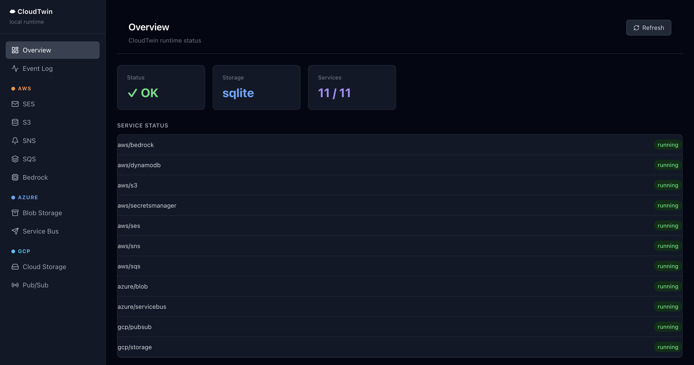
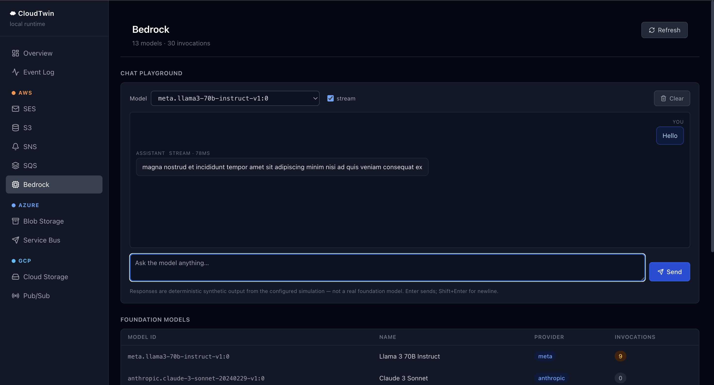
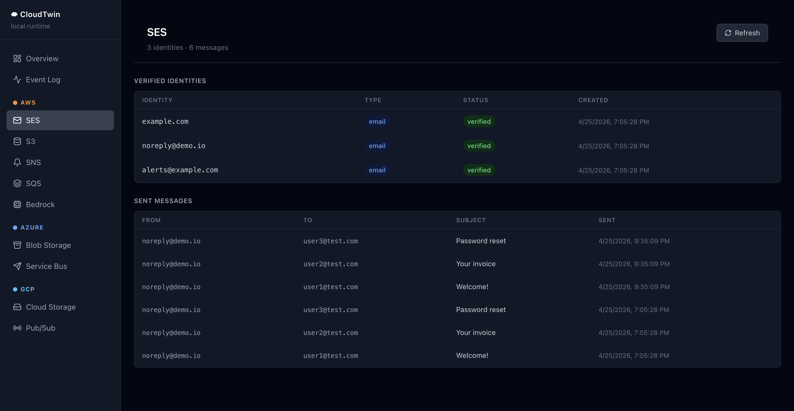
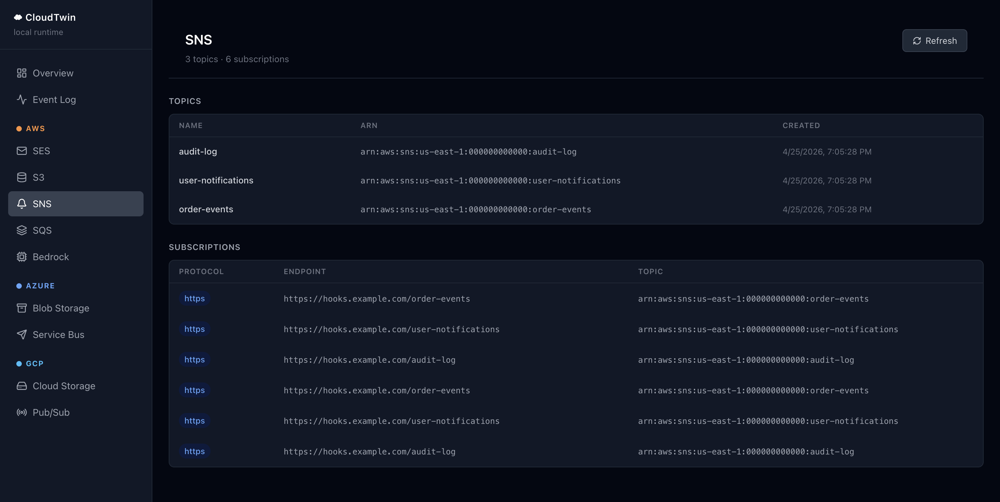

# CloudTwin

CloudTwin is a lightweight, self-contained local runtime for multi-cloud services.
It emulates AWS, Azure, and GCP service APIs inside a single process with no
external dependencies — no MinIO, no RabbitMQ, no real cloud accounts required.

State is persisted in SQLite by default, or kept entirely in-memory for CI and
ephemeral test sessions. CloudTwin is designed to be a drop-in local replacement
for cloud services during development.

**Port:** `4793` → Cloud API and dashboard UI (`/dashboard` when enabled)



---

## Supported Services

| Provider | Service |
|---|---|
| AWS | SES (v1 + v2) |
| AWS | S3 |
| AWS | SNS |
| AWS | SQS |
| AWS | Lambda |
| AWS | DynamoDB |
| AWS | Secrets Manager |
| AWS | Bedrock (simulation) |
| Azure | Blob Storage |
| Azure | Service Bus |
| Azure | Queue Storage |
| Azure | Event Grid |
| Azure | Key Vault |
| Azure | Functions |
| GCP | Cloud Storage |
| GCP | Pub/Sub |
| GCP | Firestore |
| GCP | Cloud Tasks |
| GCP | Secret Manager |
| GCP | Cloud Functions |

For the full list of supported operations per service, see
[docs/developer-guide.md](docs/developer-guide.md#supported-operations).

---

## Running with Docker

The easiest way to get started is with the pre-built image from Docker Hub:

```bash
docker pull creogroup/cloudtwin:latest
docker run -p 4793:4793 creogroup/cloudtwin
```

To persist data across restarts, mount a volume at `/data`:

```bash
docker run -p 4793:4793 -v cloudtwin-data:/data creogroup/cloudtwin
```

To use an optional config file, mount it at `/config/cloudtwin.yml`:

```bash
docker run -p 4793:4793 \
  -v cloudtwin-data:/data \
  -v $(pwd)/config/cloudtwin.yml:/config/cloudtwin.yml \
  creogroup/cloudtwin
```

---

## Running from Source

```bash
git clone https://github.com/creocorp/cloud-twin.git
cd cloud-twin
pip install -e ".[dev]"
python -m cloudtwin
# Listening on http://0.0.0.0:4793
```

---

## AWS Bedrock Simulation

CloudTwin includes a fully config-driven Bedrock simulation engine. It does
**not** call real models — it produces deterministic synthetic responses for
testing SDK integration, retry logic, streaming handling, and prompt routing.

### Supported features

- `text` — synthetic lorem-ipsum text generation
- `schema` — JSON object generated from a simplified JSON Schema definition
- `static` — fixed configured payload returned verbatim
- Sequences and cycles — deterministic multi-response progressions
- Prompt rules — `contains`-based rule matching for response selection
- Error injection — fire a configured error every N requests
- Latency simulation — configurable min/max response delay
- Streaming — `InvokeModelWithResponseStream` with word, char, or fixed-char chunking

### Endpoints

| Method | Path | SDK operation |
|---|---|---|
| `GET` | `/foundation-models` | `bedrock.list_foundation_models()` |
| `POST` | `/model/{modelId}/invoke` | `bedrock-runtime.invoke_model()` |
| `POST` | `/model/{modelId}/invoke-with-response-stream` | `bedrock-runtime.invoke_model_with_response_stream()` |

All three endpoints are served by **both** the Python backend and CloudTwin
Lite (Rust) with byte-for-byte identical request/response shapes — feature
parity covers `text` / `schema` / `static` modes, sequence/cycle progressions,
prompt rules (`contains`), periodic error injection (`every: N`), latency
simulation, and EventStream streaming with `word` / `char` / `fixed` chunking.
Responses include `x-cloudtwin-request-count` and `x-cloudtwin-response-source`
headers so test harnesses can introspect the resolved scenario. The full
Bedrock integration suite (`tests/integration/providers/aws/test_bedrock_boto3.py`,
25 tests) passes against both backends.

### Dashboard chat playground

The dashboard's **AWS → Bedrock** page includes an interactive chat window for
sending prompts to any configured model. It calls the live `/model/{id}/invoke`
and `/model/{id}/invoke-with-response-stream` endpoints, decodes the EventStream
binary frames in the browser, and shows the resolution source and request count
returned by the backend — useful for quickly probing scenario rules and
streaming behaviour without writing SDK code.

### Quick example

```python
import boto3, json

client = boto3.client(
    "bedrock-runtime",
    endpoint_url="http://localhost:4793",
    aws_access_key_id="test",
    aws_secret_access_key="test",
    region_name="us-east-1",
)

resp = client.invoke_model(
    modelId="anthropic.claude-3-sonnet-20240229-v1:0",
    body=json.dumps({"prompt": "Summarise this document"}).encode(),
    contentType="application/json",
    accept="application/json",
)
result = json.loads(resp["body"].read())
print(result["content"])  # synthetic lorem-ipsum text
```

### YAML configuration

The `bedrock:` section in `cloudtwin.yml` has two fields:

- **`defaults:`** — fallback `mode` (and optional `latency`) for any model with no explicit behaviour configured.
- **`models:`** — every key is a model ID. Each entry appears in `ListFoundationModels` and optionally defines its simulation behaviour. `name:` and `provider:` are optional display metadata; both are derived from the model ID key if omitted.

Both the Python backend and CloudTwin Lite read this from the same `cloudtwin.yml` — there is no separate Bedrock config file.

```yaml
bedrock:
  defaults:
    mode: text          # text | schema | static
    latency:
      min_ms: 50
      max_ms: 120

  models:
    # Real foundation model — name/provider shown in ListFoundationModels.
    # No mode set, so it falls back to defaults.mode (lorem-ipsum text).
    anthropic.claude-3-sonnet-20240229-v1:0:
      name: Claude 3 Sonnet
      provider: anthropic

    # Return a generated JSON object matching a schema.
    my-model.schema:
      mode: schema
      schema:
        type: object
        properties:
          summary:    { type: string }
          confidence: { type: number }
      streaming:
        enabled: true
        chunk_mode: word
        first_chunk_delay_ms: 150
        chunk_delay_ms: 20

    # Inject an error every 5th request.
    my-model.flaky:
      mode: text
      errors:
        - every: 5
          type: ThrottlingException
          message: "Every 5th request is throttled"

    # Match on prompt content.
    my-model.rules:
      mode: text
      rules:
        - contains: sentiment
          response: { static: { sentiment: positive, score: 0.9 } }
        - contains: fail
          error: { type: ValidationException, message: Rejected by rule }
```

See [docs/developer-guide.md](docs/developer-guide.md#aws-bedrock-simulation) for the full reference.

---

## Configuration

CloudTwin is configured via environment variables or a YAML file at
`CLOUDTWIN_CONFIG_PATH` (default `/config/cloudtwin.yml`). Environment
variables take precedence.

| Variable | Default | Description |
|---|---|---|
| `CLOUDTWIN_HOST` | `0.0.0.0` | Bind address |
| `CLOUDTWIN_API_PORT` | `4793` | API port used for both cloud endpoints and the dashboard UI |
| `CLOUDTWIN_STORAGE_MODE` | `sqlite` | `sqlite` or `memory` |
| `CLOUDTWIN_STORAGE_PATH` | `./data/cloudtwin.db` | SQLite database path |
| `CLOUDTWIN_CONFIG_PATH` | `/config/cloudtwin.yml` | Path to YAML config file |
| `CLOUDTWIN_DASHBOARD_ENABLED` | `true` | Mount the dashboard UI at `/dashboard` |

**Example `cloudtwin.yml`:**

```yaml
cloudtwin:
  api_port: 4793
  storage:
    mode: sqlite
    path: /data/cloudtwin.db
  providers:
    aws:
      services: ["ses", "s3", "sns", "sqs", "bedrock"]
  dashboard:
    enabled: true
  bedrock:
    defaults:
      mode: text
    models:
      anthropic.claude-3-sonnet-20240229-v1:0:
        name: Claude 3 Sonnet
        provider: anthropic
```

---

## Storage Modes

| Mode | How to enable | Notes |
|---|---|---|
| `sqlite` (default) | `CLOUDTWIN_STORAGE_MODE=sqlite` | State persists across restarts |
| `memory` | `CLOUDTWIN_STORAGE_MODE=memory` | No file I/O — ideal for CI and ephemeral test runs |

---

## Dashboard

The dashboard is served by the same FastAPI process and API port as CloudTwin.
When enabled, open `http://localhost:4793/dashboard`.

The UI route and backing endpoints are:

- UI entry: `/dashboard`
- Static assets: `/dashboard/static/...`
- JSON API: `/api/dashboard/*`

Enable or disable the UI mount via environment variable or config:

```bash
CLOUDTWIN_DASHBOARD_ENABLED=true python -m cloudtwin
```

Or in `cloudtwin.yml`:

```yaml
dashboard:
  enabled: true
```

The dashboard provides:

- **Overview** — live service health and recent event counts
- **Per-service pages** — browse and inspect resources for each service
  (SES identities and messages, S3 buckets and objects, SNS topics, SQS queues,
   Bedrock foundation models with an interactive **chat playground**,
   Azure Blob containers, Azure Service Bus queues/topics, GCP Cloud Storage
   buckets, GCP Pub/Sub topics and subscriptions)
- **Event log** — filterable stream of all actions emitted by the telemetry engine

| Overview | Bedrock Chat Playground |
|---|---|
|  |  |

| SES — identities & sent messages | SNS — topics & subscriptions |
|---|---|
|  |  |

The dashboard auto-polls the `/api/dashboard/*` endpoints. The backend router
for those endpoints is part of the main app; enabling the dashboard controls
whether the browser UI is mounted at `/dashboard`.

---

## Testing

```bash
# All integration tests (in-memory, no external services required)
make test-integration

# Directly
python -m pytest tests/integration/ -q
```

### Cross-implementation parity

The Python integration suite can be run against the Rust binary to verify
feature parity end-to-end. Set `CLOUDTWIN_TEST_URL` to skip spawning the
in-process Python app and point boto3/Azure/GCP clients at a running
backend instead:

```bash
make rust-build           # produce ./rust/cloudtwin-lite/target/release/cloudtwin-lite
make rust-test-parity     # boots the Rust binary on :47930 and runs the Bedrock suite against it
```

The Bedrock suite passes 100% against both backends. Other AWS services
(SES, S3, SNS, SQS, DynamoDB, Secrets Manager) share the same root URL
layout and are largely parity-tested, with a small number of pre-existing
edge-case gaps in CloudTwin Lite. Azure and GCP are mounted at different
paths (`/azure/`, `/gcp/`) in the Rust binary versus root in Python, so
their SDK fixtures are not directly portable across backends.

---

## CloudTwin Lite (Rust)

A single statically-linked binary with no Python runtime dependency, suitable
for embedding in CI pipelines or resource-constrained environments.
Source is under [`rust/cloudtwin-lite/`](rust/cloudtwin-lite/).

**Implemented services:** S3, SES (v1 + v2), SNS, SQS, DynamoDB, Secrets Manager,
**Bedrock (simulation)**, Azure Blob Storage, Azure Service Bus, GCP Cloud Storage,
GCP Pub/Sub.

**Run with Docker:**

```bash
docker pull creogroup/cloudtwin-lite:latest
docker run -p 4793:4793 creogroup/cloudtwin-lite
```

**Build from source:**

```bash
cd rust/cloudtwin-lite
cargo build --release
./target/release/cloudtwin-lite
# Listening on http://0.0.0.0:4793
```

Or via Make from the repo root:

```bash
make rust-build        # release build
make rust-run          # build + run
make rust-check        # cargo check only
```

**Configuration:**

Both CloudTwin Lite and the Python backend read the same `cloudtwin.yml` file
(path controlled by `CLOUDTWIN_CONFIG_PATH`, defaulting to `/config/cloudtwin.yml`).
Environment variables take precedence over YAML values where both apply.

| Variable | Default | Description |
|---|---|---|
| `CLOUDTWIN_CONFIG_PATH` | `/config/cloudtwin.yml` | Path to YAML config file (shared with Python backend) |
| `CLOUDTWIN_PORT` | `4793` | Port to listen on (overrides `api_port` in YAML) |
| `CLOUDTWIN_DB_PATH` | `/data/cloudtwin-lite.db` | SQLite database path (`:memory:` for in-memory) |

**Routing:**

| Provider | Base path |
|---|---|
| AWS (S3, SES, SNS, SQS, DynamoDB, Secrets Manager) | `/` |
| Azure (Blob Storage, Service Bus) | `/azure/` |
| GCP (Cloud Storage, Pub/Sub) | `/gcp/` |

See [docs/developer-guide.md](docs/developer-guide.md) for architecture and contribution notes.

---

## Contributing

See [docs/developer-guide.md](docs/developer-guide.md) for architecture,
design patterns, and instructions for adding new services or providers.

